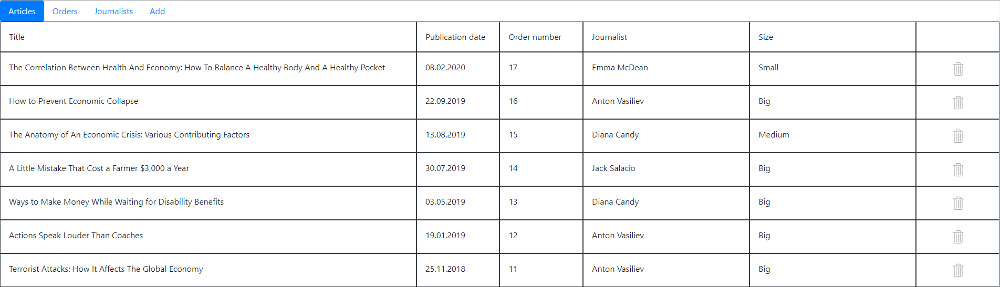

# Article Service
## Vision

"Article Service" is a simple web-applicaton which allows users to record information about articles, journalists and orders which provides service for customers.

Application should:
- Store article orders, journalists and articles in database
- Display list of orders
- Provide updating list of orders (adding and removing)
- Display list of articles
- Provide updating list of articles (adding and removing)
- Display list of journalists
- Provide updating list of journalists (adding and removing)
- Display number of written article for journalists
- Provide filtering journalists by number of written articles and by verification

## 1. Articles

### 1.1 Display list of articles

The mode is designed to view the list of articles.

***Main scenario:***
- User selects item “Articles”
- Application displays list of articles

Pic. 1.1 View the articles list.

The list displays the following columns:
- Title – the title of an article	
- Publication date – date of publication
- Order number - unique number of an order
- Journalist – name of journalist who wrote an article
- Size - size of an article.

### 1.2 Add article

***Main scenario:***
- User clicks the “Add” button in the articles list view mode
- Application displays form to enter order data
- User enters article data and presses “Save” button
- If any data is entered incorrectly, incorrect data message is displayed
- If entered data is valid, then record is adding to database
- If new article record is successfully added, then list of orders with added records is displaying and status of order corresponding to an article is changed to "Complete".

***Cancel operation scenario:***
- User clicks the “Add” button in the article list view mode
- Application displays form to enter article data
- User enters article data and presses “Cancel” button
- Data is not saved in database, then list of articles records is displaying to user
- If the user selects the menu item "Articles”, ”Orders” or "Journalists", the data will not be saved to the database and the corresponding form with updated data will be opened.

*---PIC---*
Pic. 1.2 Add article.

When adding an article, the following details are entered:
- Title – title of an article
- Order number - unique number of an order
- Journalist – name of journalist who wrote an article
- Size - size of an article.

### 1.3 Remove article

***Main scenario:*** 
- The user, while in the list of articles, presses the "Delete" button in the selected article line
- A confirmation dialog is displayed
- The user confirms the removal of the article
- Record is deleted from database
- If order record is successfully deleted, then list of articles without deleted record is displaying and status of order corresponding to an article is changed to "In process".

*---PIC---*
Pic. 2.3 Delete article dialog.

***Cancel operation scenario:***
- User is in display mode of articles list and presses “Delete” button
- Application displays confirmation dialog “Please confirm delete article?”
- User presses “Cancel” button
- List of articles without changes is displaying.

## 2. Orders

### 2.1 Display list of orders

The mode is designed to view the list of orders.

***Main scenario:***
- User selects item “Orders”
- Application displays list of Orders

*---PIC---*
Pic. 2.1 View the orders list.

The list displays the following columns:
- Client – full name of client
- Order date – date of ordering
- Category - theme of an article
- Price – price of article in US dollars
- Status - status of an order.

### 2.2 Add order

***Main scenario:***
- User clicks the “Add” button in the orders list view mode
- Application displays form to enter order data
- User enters order data and presses “Save” button
- If any data is entered incorrectly, incorrect data message is displayed
- If entered data is valid, then record is adding to database
- If new order record is successfully added, then list of orders with added records is displaying. 

***Cancel operation scenario:***
- User clicks the “Add” button in the order list view mode
- Application displays form to enter order data
- User enters order data and presses “Cancel” button
- Data is not saved in database, then list of orders records is displaying to user
- If the user selects the menu item "Articles”, ”Orders” or "Journalists", the data will not be saved to the database and the corresponding form with updated data will be opened.

*---PIC---*
Pic. 2.2 Add order.

When adding an order, the following details are entered:
- Client name – client’s first and last name
- Category – article's theme
- Price – the price of an order.

### 2.3 Remove order

***Main scenario:*** 
- The user, while in the list of orders, presses the "Delete" button in the selected order line
- If the order can't be removed, nothing happens
- If the order can be removed, a confirmation dialog is displayed
- The user confirms the removal of the order
- Record is deleted from database
- If order record is successfully deleted, then list of orders without deleted record is displaying.

*---PIC---*
Pic. 2.3 Delete order dialog.

***Cancel operation scenario:***
- User is in display mode of orders list and presses “Delete” button
- Application displays confirmation dialog “Please confirm delete order?”
- User presses “Cancel” button
- List of orders without changes is displaying.

## 3. Journalists

### 3.1 Display list of journalists

The mode is designed to view the list of journalists.

***Main scenario:***
- User selects item “Journalists”
- Application displays list of journalists

*---PIC---*
Pic. 3.1 View the journalists list.

The list displays the following columns:
- First name – first name of a journalist
- Last name – last name of a journalist
- Start date - date when journalist joined the service
- Number of articles - number of articles written by a journalist
- Verified - boolean column which notes if a journalist is verified.

### 3.2 Add journalist

***Main scenario:***
- User clicks the “Add” button in the journalists list view mode
- Application displays form to enter journalist information
- User enters journalist information and presses “Save” button
- If any data is entered incorrectly, incorrect data message is displayed
- If entered data is valid, then record is adding to database
- If new journalist record is successfully added, then list of journalists with added records is displaying. 

***Cancel operation scenario:***
- User clicks the “Add” button in the journalist list view mode
- Application displays form to enter journalist inforamation
- User enters journalist information and presses “Cancel” button
- Data is not saved in database, then list of journalists records is displaying to user
- If the user selects the menu item "Articles”, ”Orders” or "Journalists", the data will not be saved to the database and the corresponding form with updated data will be opened.

*---PIC---*
Pic. 3.2 Add journalist.

When adding an order, the following details are entered:
- First name – first name of a journalist
- Last name – last name of a journalist
- Verified - boolean column which notes if a journalist is verified.

### 3.3 Remove journalist

***Main scenario:*** 
- The user, while in the list of orders, presses the "Delete" button in the selected order line
- A confirmation dialog is displayed
- The user confirms the removal of the order
- Record is deleted from database
- If order record is successfully deleted, then list of orders without deleted record is displaying.

*---PIC---*
Pic. 3.3 Delete journalist dialog.

***Cancel operation scenario:***
- User is in display mode of orders list and presses “Delete” button
- Application displays confirmation dialog “Please confirm delete order?”
- User presses “Cancel” button
- List of orders without changes is displaying.

### 3.4 Filter journalists

***Filtering by number of articles:***
- From the offered manu user can choose "0-5 articles", "6-10 articles" or "10+ articles"
- The appropriate journalists will be displayed in the journalists list

*---PIC---*
Pic. 3.4 Filter journalists by number of articles.

***Filtering verified journalists:***
- From the offered manu user can put a checkbox if he wants to see only verified journalists
- Only verified journalists will be displayed in the journalists list

*---PIC---*
Pic. 3.4 Filter verified journalists.
